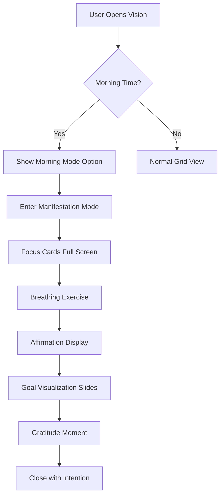

# Vision Page Improvement Plan: Morning Manifestation Mode

## Executive Summary

Transform the Vision page into an immersive **Morning Manifestation Experience** that helps users visualize and embody their goals through psychological visualization techniques, combining neuroscience-backed methods with elegant UI/UX design.

---

## Part 1: Psychological Foundation

### The Science of Visualization

1. **Neuroscience Perspective** (Source: Dr. Andrew Huberman, Dr. Joe Dispenza)
   - Mental rehearsal activates same neural pathways as physical practice
   - Vivid sensory visualization creates new neural associations
   - Emotional engagement amplifies neuroplasticity
   - The brain cannot distinguish between vividly imagined and real experiences

2. **Sports Psychology**
   - Olympic athletes use visualization to pre-experience success
   - Key elements: Sensory richness, first-person perspective, emotional engagement
   - Focus on "being" rather than "doing" (state-based vs task-based)

3. **Manifestation Psychology** (Law of Attraction)
   - Feeling as if already achieved (pre-awareness)
   - Gratitude practice for future achievements
   - Removing resistance (stress, deadlines, pressure)

### Key Psychological Needs for Morning Visualization

| Need | Current Gap | Solution |
|------|-------------|----------|
| Immersive experience | Distracting UI elements | Full-screen, minimalist mode |
| Emotional connection | Progress bars create stress | Remove deadlines in manifest mode |
| Sensory richness | Static images only | Video backgrounds, ambient sounds |
| Gratitude focus | No affirmation system | Add affirmation cards |
| Morning routine | Generic dashboard | Dedicated morning entry point |

---

## Part 2: UI/UX Design Recommendations

### 2.1 New View: "Morning Manifestation Mode"

**Concept:** A dedicated, distraction-free mode specifically designed for morning visualization ritual.

#### Core Features:



#### Visual Design Specifications:

| Element | Specification |
|---------|--------------|
| **Background** | Soft gradient: Dawn colors (warm peach → soft lavender → gentle blue) |
| **Typography** | Large, elegant serif fonts for titles (48-64px), clean sans-serif for body |
| **Spacing** | Generous whitespace, centered layouts |
| **Animations** | Slow, breathing-like transitions (3-5 second ease-in-out) |
| **Elements** | No progress bars, no deadlines, no checkboxes in manifest mode |

#### UX Flow:

1. **Entry Animation** (3 seconds)
   - Gentle fade from black to morning gradient
   - Soft inspirational quote appears
   - Ambient morning sound begins (birds, soft music)

2. **Focus Selection** (if multiple goals)
   - Show only "Focus This Month" goals as large cards
   - User selects ONE goal to visualize (or "All")
   - Swipe or tap to select

3. **Visualization Sequence** (30-60 seconds per goal)
   - Full-screen media (image or looping video)
   - Title appears with fade-in
   - Guided text prompts:
     - "Close your eyes... breathe..."
     - "Imagine you have already achieved this..."
     - "What does it feel like?"
     - "Who are you becoming?"
   - Background loops calming video

4. **Affirmation Card** (15 seconds)
   - Card with positive affirmation based on goal category
   - User can customize affirmations in settings

5. **Gratitude Closing**
   - "What are you grateful for today?"
   - Simple text input (optional, saved to diary)

### 2.2 Feature Enhancements

#### A. Manifestation Card Design

```
┌─────────────────────────────────────────┐
│                                         │
│     [Full-screen Image/Video Loop]      │
│                                         │
│                                         │
│         "I am becoming the              │
│          person who..."                  │
│                                         │
│    ┌─────────────────────────────┐      │
│    │    ✨ AFFIRMATION TEXT ✨   │      │
│    └─────────────────────────────┘      │
│                                         │
│         [Breathe: ○ ○ ○]                │
│                                         │
└─────────────────────────────────────────┘
```

#### B. Audio Integration

| Sound Type | Use Case | Implementation |
|------------|----------|----------------|
| Ambient Nature | Background in manifest mode | Birds, soft rain, ocean waves |
| Breathing Guide | Synchronized with UI | 4-7-8 breathing pattern |
| Achievement Sound | Goal completed | Subtle chime |
| Transition Sounds | Between slides | Soft whoosh |

#### C. Breathing Exercise Component

- Visual: Expanding/contracting circle
- Pattern options:
  - Box breathing (4-4-4-4)
  - Relaxing breath (4-7-8)
  - Custom interval
- Synchronized with gentle sound

#### D. Affirmation System

**Pre-built Affirmations by Category:**

| Category | Sample Affirmations |
|----------|---------------------|
| Personality | "I am becoming the best version of myself" |
| Work | "I am a magnet for opportunities and success" |
| Ouro | "I am in perfect harmony with my inner self" |
| Enjoyment | "I deserve joy and abundance in all areas" |
| Routine | "My habits create the life I desire" |

**Custom Affirmations:**
- User can add personal affirmations
- AI-generated suggestions based on goals

### 2.3 Dashboard Integration

**Morning Greeting Enhancement:**

```
┌────────────────────────────────────────────────┐
│  ☀️ Good Morning, [Name]                      │
│                                                │
│  ┌────────────────────────────────────────┐   │
│  │  🌟 Your Focus Today                   │   │
│  │  [Goal Image]                          │   │
│  │  "I am manifesting..."                │   │
│  │                                        │   │
│  │  [Start Visualization →]               │   │
│  └────────────────────────────────────────┘   │
│                                                │
│  Today's Manifestation: [Quick access button] │
└────────────────────────────────────────────────┘
```

---

## Part 3: Implementation Plan

### Phase 1: Core Experience (Week 1-2)

| Task | Description |
|------|-------------|
| Create `morning-manifest.js` | New view module for manifestation mode |
| Add `manifest-mode.css` | Styling for full-screen experience |
| Build card carousel | Swipeable goal cards for selection |
| Add breathing visual | Animated breathing circle component |
| Integrate audio system | Background sounds and breathing guide |

### Phase 2: Audio & Polish (Week 3)

| Task | Description |
|------|-------------|
| Add sound manager | Handle audio loading and playback |
| Create sound assets | Ambient sounds, transitions |
| Affirmation system | Pre-built + custom affirmations |
| Settings page | Sound preferences, custom affirmations |

### Phase 3: Dashboard & Integration (Week 4)

| Task | Description |
|------|-------------|
| Enhance morning greeting | Add vision focus preview |
| Add quick-start button | One-tap to enter manifest mode |
| Persist preferences | Remember last viewed goal |
| Analytics | Track morning session starts |

---

## Part 4: Technical Specifications

### File Structure (New Files)

```
├── view-manifest.js          # Main manifestation view
├── manifest-styles.css       # Styles for manifest mode
├── manifest-audio.js         # Audio management
└── assets/
    └── sounds/
        ├── morning-ambient.mp3
        ├── breathing-guide.mp3
        └── achievement-chime.mp3
```

### Settings Schema

```javascript
manifestSettings: {
  autoStartMorning: false,      // Auto-open manifest mode in morning
  soundEnabled: true,
  defaultSound: 'birds',        // birds, ocean, rain, silence
  breathingPattern: '4-7-8',    // 4-7-8, box, custom
  showAffirmations: true,
  customAffirmations: [],       // User's personal affirmations
  dailyGoalSelection: 'focus',  // 'focus', 'all', 'random'
  morningStartTime: '06:00',    // When morning mode activates
  eveningCutoff: '10:00'        // When to stop showing morning UI
}
```

### Entry Points

1. **From Vision Page:**
   - New button: "🌅 Morning Mode" (visible in morning hours)
   - Tab/filter: "✨ Manifest"

2. **From Dashboard:**
   - Enhanced morning greeting section
   - "Start Visualization" button

3. **Direct Access:**
   - Command palette: "Start morning visualization"
   - Notification quick action

---

## Part 5: Comparison - Current vs. Improved

| Aspect | Current UI | Improved UI |
|--------|-----------|-------------|
| **Purpose** | Goal tracking | Morning ritual |
| **Emotion** | Task-oriented | Inspiring, calm |
| **Visuals** | Grid of cards | Immersive full-screen |
| **Progress** | Prominent % bars | Hidden |
| **Deadlines** | Visible countdown | Removed |
| **Audio** | None | Ambient + breathing |
| **Interaction** | Click to view details | Guided sequence |
| **Duration** | Unlimited | 2-5 minutes ritual |
| **Time** | Any time | Morning-optimized |

---

## Summary

This transformation turns the Vision page from a **goal management tool** into a **morning manifestation ritual**. The key psychological principles applied:

1. **State-based thinking** - Focus on who you're becoming, not just what you're doing
2. **Emotional engagement** - Feel the achievement before it happens
3. **Sensory richness** - Video, audio, and visual design create immersion
4. **Removal of resistance** - No deadlines or progress pressure in manifest mode
5. **Gratitude practice** - Connection to positive emotions
6. **Breathing integration** - Calms nervous system for better visualization

The user can now start their morning with a 2-5 minute ritual that helps them truly **feel** and **embody** their goals, making visualization actually work psychologically.

---

*Plan created for: OS-master Vision Page Enhancement*
*Perspectives: Psychology + UI/UX Design*
